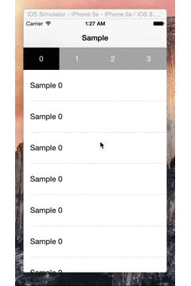

# SwipePager

[](https://developer.apple.com/iphone/index.action)
[](https://developer.apple.com/swift)
[](http://mit-license.org)
[](https://github.com/naoto0822/SwipePager/issues?state=open)

SwipePager is UIPageViewController wrapper like Gunosy, SmartNews.



# Version

- current vesion 1.0.0

# Requirements

- iOS7 and up
- Swift 1.1
- XCode 6.2

# Install

- add `SwipePager.swift` and `SwipePagerMenu.swift` to your project.

# Usage

 1. protocol declaration (`SwipePagerDataSource`, `SwipePagerDelegate` )

 ```swift
 class ViewController: UIViewController, SwipePagerDataSource, SwipePagerDelegate
 ```

 2. SwipePager initialize

 ```swift
 override func viewDidLoad() {
     super.viewDidLoad()

     let swipePager = SwipePager(frame: frame, transitionStyle: .Scroll)
     swipePager.dataSource = self
     swipePager.delegate = self
     self.view.addSubview(swipePager)
 }
 ```

 3. DataSource

 ```swift
 // ex).

 func numberOfPage(#swipePager: SwipePager) -> Int {
     return 3
 }

 func sizeForMenu(#swipePager: SwipePager) -> CGSize {
     return CGSizeMake(80, 50)
 }

 func menuViews(#swipePager: SwipePager) -> [SwipePagerMenu] {
     // use SwipePagerMenu Class
     var array: [SwipePagerMenu] = []

     for var i = 0; i < 8; i++ {
         var menu = SwipePagerMenu()
         // customize color
         menu.stateNormalColor = UIColor.lightGrayColor()
         menu.stateNormalFontColor = UIColor.whiteColor()
         menu.stateHighlightColor = UIColor.blackColor()
         menu.stateHighlightFontColor = UIColor.whiteColor()
         // label title
         if i == 0 { menu.title = "0" }
         if i == 1 { menu.title = "1" }
         if i == 2 { menu.title = "2" }
         array.append(menu)
     }

     return array
 }

 func viewControllers(#swipePager: SwipePager) -> [UIViewController] {
     var array: [UIViewController] = []

     for var i = 0; i < 8; i++ {
         let viewController = UIViewController()
         // viewController setting...
         array.append(viewController)
     }

     return array
 }
 ```

 4. Delegate

 ```swift
 func swipePager(#swipePager: SwipePager, didMoveToPage: Int) {
     println("move to \(didMoveToPage.description)")
 }
 ```

# License

The MIT License (MIT)

Copyright (c) 2015 naoto yamaguchi

Permission is hereby granted, free of charge, to any person obtaining a copy
of this software and associated documentation files (the "Software"), to deal
in the Software without restriction, including without limitation the rights
to use, copy, modify, merge, publish, distribute, sublicense, and/or sell
copies of the Software, and to permit persons to whom the Software is
furnished to do so, subject to the following conditions:

The above copyright notice and this permission notice shall be included in all
copies or substantial portions of the Software.

THE SOFTWARE IS PROVIDED "AS IS", WITHOUT WARRANTY OF ANY KIND, EXPRESS OR
IMPLIED, INCLUDING BUT NOT LIMITED TO THE WARRANTIES OF MERCHANTABILITY,
FITNESS FOR A PARTICULAR PURPOSE AND NONINFRINGEMENT. IN NO EVENT SHALL THE
AUTHORS OR COPYRIGHT HOLDERS BE LIABLE FOR ANY CLAIM, DAMAGES OR OTHER
LIABILITY, WHETHER IN AN ACTION OF CONTRACT, TORT OR OTHERWISE, ARISING FROM,
OUT OF OR IN CONNECTION WITH THE SOFTWARE OR THE USE OR OTHER DEALINGS IN THE
SOFTWARE.
